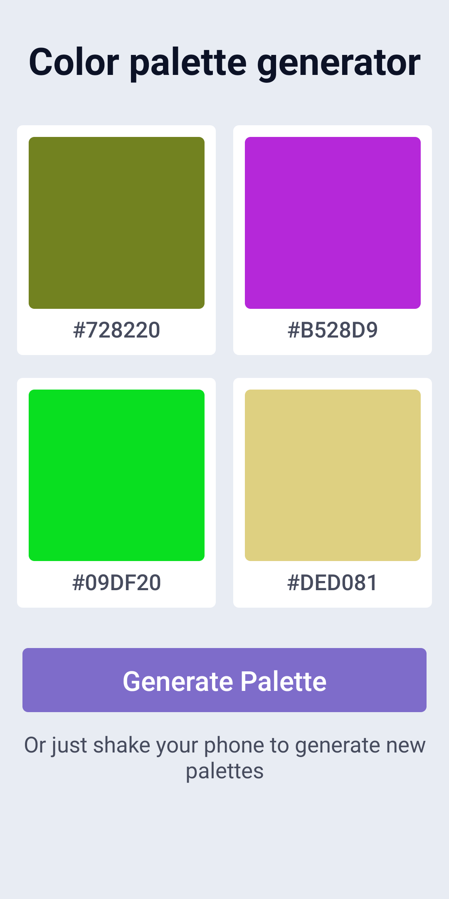
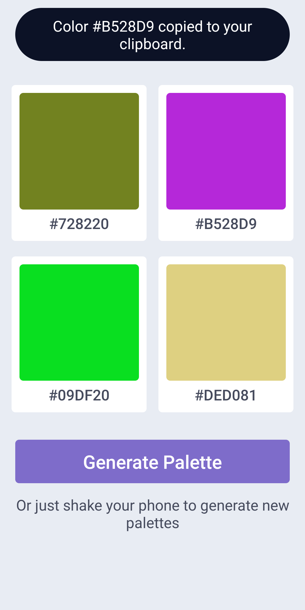

# Color palette Generator

This is a color palette generator which I made as a solution to DevProject's challenge. 

&nbsp;

## Features

It has the following features:

- When opened app automatically generates a palette.
- Generates 4 random colors on the click of a button.
- Copy any color code to clipboard by just clicking the the color's card.
- It shows a notification everytime a color is copied along with the code of the color copied (Not usefull to user but something included in the challenge).

## My learnings

It was my first react native app, So I learned a lot by doing this project and that's what I love about project based learning as it's faster and more interesting than watching a tutorial or reading books, articles. 

Some of my learnings were: 

- How to layout a basic UI in react native.
- How to use clickable elements like buttons and TouchableOpacity and add onPress functions to them.
- Used some react stuff like useState, useEffect, useContext and passing of props.
- Learned basics of animations in react native by animating the notification.
- Used libraries like clipboard and react-native-super-grid.